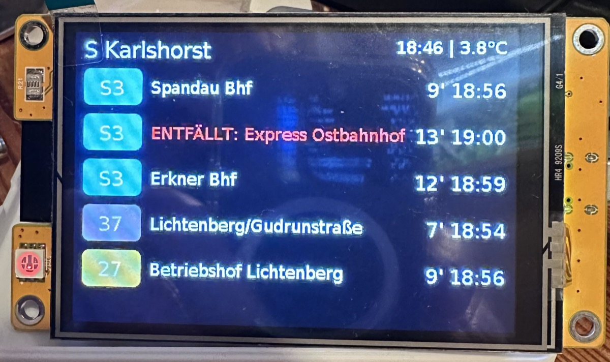

# ESPHome CYD BVG Departure Display

[](https://opensource.org/licenses/MIT)
[](https://esphome.io/)
[](https://www.home-assistant.io/)
[](https://github.com/YOUR_USERNAME/esphome-cyd-bvg-departure-display)

<p align="center">
  
</p>

> 🚇 Real-time Berlin public transport (BVG/VBB) departure board for the ESP32 CYD (Cheap Yellow Display) using ESPHome and LVGL.

## ✨ Features

- 📱 **Real-time departure information** from BVG/VBB Berlin public transport
- 🚇 **Smart filtering**: Separate displays for S-Bahn (westbound/eastbound) and Tram/Bus
- 🔴 **Visual alerts**: Red pulsing LED for delays > 5 minutes on important routes
- 🌙 **Auto-brightness**: Built-in LDR sensor for automatic display dimming
- 🎨 **Color-coded lines**: Official BVG line colors for easy identification
- ⚠️ **Cancellation warnings**: Clear display of cancelled departures
- ⏱️ **Delay information**: Shows real-time delays directly with departure times
- 📍 **Station customization**: Easy configuration for any BVG/VBB station

## 🖼️ Screenshots

<details>
<summary>📸 Click to see more images</summary>

### Normal Operation

</details>

## 🛠️ Hardware Required

- **ESP32-3248S035C** (CYD - Cheap Yellow Display) - [Purchase Link](https://www.aliexpress.com/item/1005004632953455.html)
  - 3.5" IPS touchscreen display (480x320)
  - Built-in RGB LED
  - Built-in LDR (Light Dependent Resistor)
  - ESP32 with WiFi

## 📋 Prerequisites

1. **Home Assistant** with the [BVG/VBB integration](https://github.com/vas3k/home-assistant-bvg-vbb-departures) installed
2. **ESPHome** (as Home Assistant add-on or standalone)
3. Basic knowledge of ESPHome and YAML

## 🚀 Installation

### 1. Clone this repository

```bash
cd ~/Documents/PlatformIO/Projects/
git clone https://github.com/YOUR_USERNAME/esphome-cyd-bvg-departure-display.git
cd esphome-cyd-bvg-departure-display
```

### 2. Install fonts

Download DejaVu Sans font and place it in `fonts/dejvu-fonts/DejaVuSans.ttf`

### 3. Configure Home Assistant

#### Add BVG sensor to Home Assistant

Edit your `configuration.yaml`:

```yaml
sensor:
  - platform: bvg_vbb
    stop_id: "900120003"  # S Karlshorst (change to your station)
    name: "S Karlshorst Berlin"
```

Find your station ID: [VBB Station Finder](https://www.vbb.de/fahrinfo/)

#### Install template sensors

Copy `home-assistant/packages/bvg_templates.yaml` to your Home Assistant `config/packages/` directory.

Make sure packages are enabled in `configuration.yaml`:

```yaml
homeassistant:
  packages: !include_dir_named packages
```

Restart Home Assistant.

### 4. Flash ESP32

Connect your CYD via USB and run:

```bash
esphome run cyd-bvg.yaml
```

ESPHome will prompt you for WiFi credentials on first run.

For subsequent updates (via WiFi):

```bash
esphome run cyd-bvg.yaml --device cyd-bvg.local
```

## ⚙️ Configuration

### Quick Start Configuration

Edit the **substitutions** section at the top of `cyd-bvg.yaml`:

```yaml
substitutions:
  device_name: cyd-bvg
  friendly_name: "CYD BVG"
  comment: "BVG Abfahrtsanzeige"
  # ============ CUSTOMIZE HERE ============
  station_name: "S Karlshorst"              # Display name on screen
  station_sensor: "s_karlshorst_berlin"     # HA sensor name (without 'sensor.' prefix)
  temperature_sensor: "garten_thermometer_temperature"  # HA temperature sensor
```

**What to change:**
- `station_name`: The name shown on the display (e.g., "U Alexanderplatz", "S+U Warschauer Str.")
- `station_sensor`: The sensor name from Home Assistant (find it in Developer Tools > States)
- `temperature_sensor`: Your temperature sensor entity ID (without 'sensor.' prefix)

### Customize Home Assistant Templates

Edit `home-assistant/packages/bvg_templates.yaml`:

1. **Replace sensor entity_id** (Line 13 and all occurrences):
   ```yaml
   
   ```

2. **Update unique_id prefix** (all sensor definitions):
   ```yaml
   unique_id: your_station_dep1_line  # Replace 's_karlshorst' with your station slug
   ```

3. **Adjust direction filters** (Lines 1-2 westbound, optional):
   ```yaml
   selectattr('direction', 'search', '(Charlottenburg|Ostbahnhof|Spandau)')
   # Change destinations to match your preferred directions
   ```

### Filter Departures

The display automatically filters:
- **Line 1-2**: S-Bahn towards specific destinations (e.g., Charlottenburg/Ostbahnhof/Spandau)
- **Line 3**: S-Bahn other directions
- **Line 4-5**: Tram/Bus/Metro lines

Adjust filters in `home-assistant/packages/bvg_templates.yaml`:

```yaml
# Change direction filter
selectattr('direction', 'search', '(Charlottenburg|Ostbahnhof|Spandau)')
```

### Customize Temperature Sensor

Edit `cyd-bvg.yaml` line 179:

```yaml
entity_id: sensor.your_temperature_sensor
```

### Adjust Brightness

Edit LDR sensor calibration (lines 195-196):

```yaml
float min_mv = 50.0;   # Very dark
float max_mv = 700.0;  # Very bright
```

## 🐛 Troubleshooting

### Display is white/blank
- Verify `bg_color: 0x000000` in LVGL config
- Check font files are in correct location
- Ensure DejaVu Sans font is properly installed

### Missing German characters (ß, ä, ö, ü)
- Use DejaVu Sans font (not Roboto)
- Check font glyphs include: `'äöüÄÖÜß'`

### RGB LED not working
- Verify GPIO pins: RED=22, BLUE=16, GREEN=17
- Ensure `inverted: true` on all LED outputs

### No departures showing
- Check Home Assistant BVG integration is working
- Verify template sensors are created (Developer Tools > States)
- Check ESPHome logs for errors: `esphome logs cyd-bvg.yaml`

### Light sensor wrong values
- Adjust `min_mv` and `max_mv` values
- Check sensor reading in Home Assistant
- Ensure `attenuation: 0db` (0-800mV range)

## 📁 Project Structure

```
esphome-cyd-bvg-departure-display/
├── cyd-bvg.yaml                  # ⚙️ CONFIGURE: Lines 24-27 (substitutions)
├── home-assistant/packages/
│   └── bvg_templates.yaml        # ⚙️ CONFIGURE: Replace sensor entity_id
└── ...
```

**Files to configure:**
- ✏️ `cyd-bvg.yaml` (line 329: station name, line 179: temperature sensor)
- ✏️ `home-assistant/packages/bvg_templates.yaml` (station ID and filter directions)

**Files as-is (no changes needed):**
- ✅ `includes/common.yaml`
- ✅ `includes/ota.yaml`
- ✅ `includes/dejavu-fonts.yaml`

## 🤝 Contributing

Contributions are welcome! Please feel free to submit a Pull Request.

1. Fork the project
2. Create your feature branch (`git checkout -b feature/AmazingFeature`)
3. Commit your changes (`git commit -m 'Add some AmazingFeature'`)
4. Push to the branch (`git push origin feature/AmazingFeature`)
5. Open a Pull Request

## 📝 Credits

- Original CYD template by [Aaron Stewart @makeitworktech](https://github.com/makeitworktech)
- [BVG/VBB Home Assistant Integration](https://github.com/vas3k/home-assistant-bvg-vbb-departures)
- ESPHome and LVGL communities

## 📄 License

This project is licensed under the MIT License - see the [LICENSE](LICENSE) file for details.

## 🔗 Related Projects

- [ESPHome](https://esphome.io/)
- [Home Assistant](https://www.home-assistant.io/)
- [BVG/VBB Integration](https://github.com/vas3k/home-assistant-bvg-vbb-departures)
- [CYD Display Hardware](https://github.com/witnessmenow/ESP32-Cheap-Yellow-Display)

## 💬 Support

If you have questions or need help:
- Open an [Issue](https://github.com/YOUR_USERNAME/esphome-cyd-bvg-departure-display/issues)
- Check the [ESPHome Documentation](https://esphome.io/)
- Visit the [Home Assistant Forum](https://community.home-assistant.io/)
